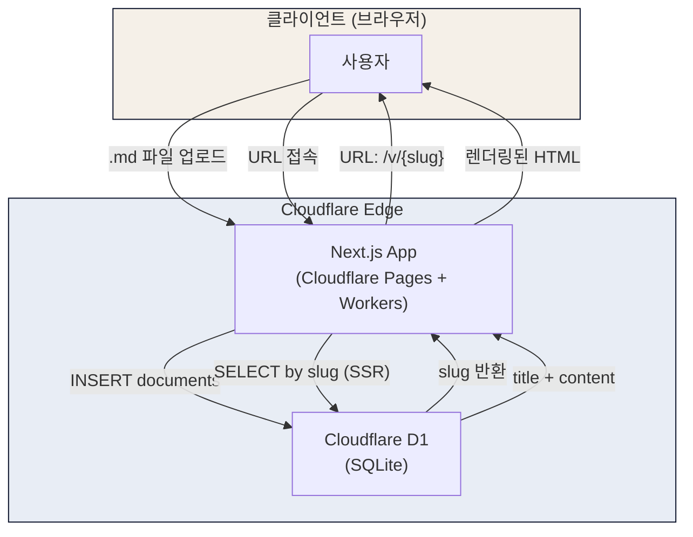
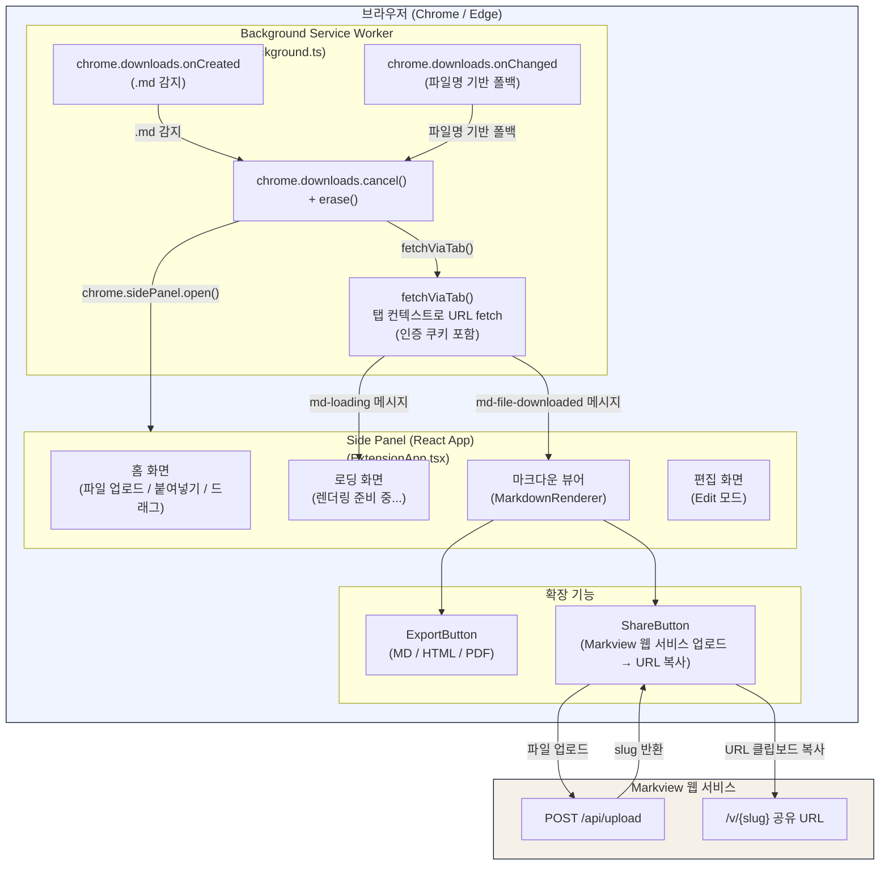

# Markview 개발 산출물

> **한컴 AX Day 제출용 개발 산출물 문서**
> 작성일: 2026년 4월 4일 | 작성자: jeongyeonkim (개발 직군)

---

## 1. 프로젝트 개요

### 서비스 소개

**Markview**는 마크다운(.md) 파일을 사람이 읽기 편한 형태로 즉시 렌더링하는 **웹 서비스**와 **브라우저 확장 프로그램**의 통합 솔루션입니다.

- **웹 서비스**: `https://markview-4hy.pages.dev`
  - .md 파일을 업로드하면 고유 URL이 생성되고, 해당 URL만 공유하면 누구나 렌더링된 문서를 브라우저에서 즉시 열람
- **브라우저 확장 프로그램**: Markview - Markdown Viewer (v1.0.0)
  - Chrome 및 Edge 브라우저 지원 (동일 Chromium 기반 코드베이스)
  - Google Chat 등에서 .md 파일 다운로드 시 파일을 디스크에 저장하지 않고 브라우저 사이드패널에서 즉시 렌더링
  - 로컬 .md 파일 더블클릭 시 브라우저에서 자동으로 markview 렌더링 페이지 표시 (PDF 열람과 동일한 UX)

---

### 문제 정의 (Before)

한컴은 **Google Chat**을 주요 소통 도구로 사용합니다. 전사적으로 AI 활용이 확산되면서, 구성원들이 AI와 협업하여 만드는 산출물의 대부분이 **.md(마크다운) 파일** 형식으로 생성됩니다.

그런데 Google Chat에서 .md 파일을 공유받은 수신자는 다음과 같은 불편한 과정을 반드시 거쳐야 했습니다.

```
[공유자]                         [수신자]
.md 파일 첨부 → 전송    →    파일 다운로드
                         →    다운로드 폴더에서 파일 탐색
                         →    VS Code 등 별도 도구 실행
                         →    파일 열기 → 열람
```

**구체적인 문제점:**

1. **수신자가 매번 파일을 다운로드해야 함** — 공유받을 때마다 반복 발생
2. **브라우저에서 .md 파일을 직접 열 수 없음** — 원시 텍스트(마크다운 문법 그대로)로만 표시됨
3. **별도 도구 필요** — VS Code, Typora 등이 설치되어 있지 않으면 열람 불가
4. **다운로드 폴더에 일회성 파일 누적** — 한 번 보고 삭제해야 할 파일들이 쌓임
5. **재공유 시 파일을 다시 첨부해야 함** — URL이 없기 때문에 링크 공유 불가

---

### 해결 방안 (After)

Markview는 두 가지 방식으로 이 문제를 근본적으로 해결합니다.

**방안 1 — 웹 서비스 (URL 공유로 파일 전달 방식 대체)**

```
[공유자]                         [수신자]
.md 파일 업로드 → URL 생성  →  URL 클릭 → 브라우저에서 즉시 열람
```

- .md 파일 업로드 → 고유 URL(`/v/{slug}`) 자동 생성 → **파일 대신 링크로 공유**
- 수신자는 URL 클릭 한 번으로 깔끔하게 렌더링된 문서를 즉시 열람
- 별도 설치, 로그인, 다운로드 불필요

**방안 2 — 브라우저 확장 프로그램 (다운로드 자체를 제로화)**

```
[수신자가 다운로드 클릭]
         ↓
  브라우저 확장이 즉시 감지
         ↓
  다운로드 자동 취소 + 흔적 제거
         ↓
  사이드패널에서 즉시 렌더링 (파일 저장 없음)
```

- Google Chat 등에서 .md 파일 다운로드 클릭 시 파일이 디스크에 저장되기 전에 인터셉트
- 브라우저 사이드패널에 렌더링된 문서가 즉시 표시
- Chrome과 Edge 양쪽 브라우저에서 동일한 경험 제공
- **완전한 제로 다운로드(Zero Download) 경험** 실현

**방안 3 — 브라우저 확장 프로그램 (로컬 .md 파일 즉시 렌더링)**

```
[로컬 .md 파일 더블클릭]
         ↓
  브라우저가 file:// URL로 파일 열기
         ↓
  확장 프로그램이 .md 파일 자동 감지
         ↓
  파일 내용 읽기 → markview API 업로드
         ↓
  markview 웹 서비스에서 풀페이지 렌더링 (TOC, 편집, 공유 모두 가능)
```

- 로컬 .md 파일을 PDF처럼 더블클릭 한 번으로 브라우저에서 즉시 열람
- markview 웹 서비스의 전체 기능(렌더링, TOC, 스플릿 에디터, 공유 URL) 그대로 활용
- 별도 마크다운 뷰어 설치 불필요 — **브라우저가 곧 마크다운 뷰어**

---

## 2. AX 효과 (Before vs After)

### 정량적 비교

| 항목 | Before | After |
|------|--------|-------|
| .md 파일 공유 방식 | 파일 첨부 후 수신자가 다운로드 | 웹 URL 클릭만으로 즉시 열람 |
| 파일 열람까지 소요 단계 | **4단계** (다운로드 → 파일 탐색 → 도구 실행 → 열람) | **1단계** (URL 클릭 / 사이드패널 자동 표시) |
| 불필요한 파일 다운로드 | 공유받을 때마다 매번 발생 | **제로(Zero)** — 웹 URL 공유 또는 확장 프로그램 자동 인터셉트 |
| .md 열람에 필요한 도구 | VS Code, Typora 등 별도 설치 필수 | **브라우저만으로 가능** (추가 설치 불필요) |
| 파일 재공유 방식 | .md 파일을 다시 첨부하여 전송 | **URL 1회 생성 → 무제한 공유** |
| 다운로드 폴더 파일 누적 | 공유받을 때마다 파일 쌓임 | 누적 없음 (디스크에 파일 저장 자체가 발생하지 않음) |
| 문서 실시간 편집 후 재공유 | 편집 → 저장 → 재첨부 → 재전송 | 편집 → 저장 → 기존 URL 그대로 유지 |
| 렌더링 품질 | 원시 텍스트 그대로 표시 (마크다운 문법 노출) | GFM, LaTeX, Mermaid, 코드 하이라이팅 등 완전 렌더링 |

### 직무 경계 확장 (Level 3 AX 달성)

이 프로젝트는 **개발 직군 1인**이 AI와 함께 다음 전 과정을 단독 수행한 사례입니다.

| 역할 | 기존 필요 인원 | Markview에서 |
|------|--------------|-------------|
| 서비스 기획 / UX 기획 | 기획자 1인 | AI와 함께 개발자 1인이 수행 |
| UI/UX 디자인 | 디자이너 1인 | AI와 함께 개발자 1인이 수행 |
| 프론트엔드 개발 | FE 개발자 1인 | 개발자 1인이 수행 |
| 백엔드 개발 / API 설계 | BE 개발자 1인 | 개발자 1인이 수행 |
| 인프라 / 배포 | 인프라 담당자 1인 | 개발자 1인이 수행 |
| 브라우저 확장 프로그램 개발 (Chrome + Edge) | 별도 개발자 1인 | 개발자 1인이 수행 |

**기존 최소 3~5인이 필요한 규모의 프로젝트를 AI와 함께 개발 직군 1인이 전 과정 수행.**

### 조직 기여도 (Level 4 방향)

- **전사 .md 파일 공유 문화를 "파일 전달"에서 "URL 공유"로 전환** — 한 번 URL을 쓰면 이전 방식으로 돌아갈 이유가 없는 구조적 전환
- **Google Chat 업무 환경에서 다운로드 없는 즉시 열람 경험 제공** — AI 산출물의 소비 마찰을 제거
- **AI 산출물 소비 효율성 향상 → AI 활용 확산에 기여** — AI가 만든 .md 파일을 더 편하게 공유하고 소비할수록, 전사 AI 활용이 가속화

---

## 3. 서비스 상세 — 웹 앱

### 기술 스택

| 분류 | 기술 | 버전 |
|------|------|------|
| 프레임워크 | Next.js | 16.1.7 |
| UI 라이브러리 | React | 19.2.3 |
| 언어 | TypeScript | ^5 |
| 스타일링 | Tailwind CSS | ^4 |
| 마크다운 렌더러 | react-markdown | ^10.1.0 |
| 마크다운 플러그인 | remark-gfm | ^4.0.1 |
| 수식 파싱 | remark-math | ^6.0.0 |
| 수식 렌더링 | rehype-katex | ^7.0.1 |
| 코드 하이라이팅 | rehype-highlight | ^7.0.2 |
| HTML 새니타이징 | rehype-sanitize | ^6.0.0 |
| 다이어그램 | Mermaid | ^11.13.0 |
| 배포 어댑터 | @opennextjs/cloudflare | ^1.17.1 |
| 클라우드 런타임 | Cloudflare Workers | — |
| 패키지 관리 | Wrangler | ^4.75.0 |

### 아키텍처 구성도



**업로드 플로우:**
```
사용자 → .md 파일 선택 → POST /api/upload
       → 파일 검증 (확장자 .md, 최대 512KB)
       → 제목 추출 (# 헤더 파싱)
       → slug 생성 (UUID 8자리)
       → Cloudflare D1에 INSERT
       → slug 반환 → /v/{slug}로 리다이렉트
```

**열람 플로우:**
```
수신자 → URL 클릭 (/v/{slug})
       → Next.js SSR: D1에서 slug로 문서 조회
       → 제목 + 마크다운 콘텐츠 → 클라이언트로 전달
       → react-markdown으로 렌더링
       → 완전히 렌더링된 페이지 표시
```

### 주요 기능

| 기능 | 설명 |
|------|------|
| **마크다운 렌더링** | GFM(GitHub Flavored Markdown) 완전 지원 — 테이블, 체크리스트, 취소선, 코드 블록 등 |
| **LaTeX 수식** | remark-math + rehype-katex 기반 인라인/블록 수식 렌더링 |
| **Mermaid 다이어그램** | 플로우차트, 시퀀스 다이어그램, 클래스 다이어그램 등 — 샌드박스 iframe 렌더링 |
| **코드 하이라이팅** | rehype-highlight 기반 100+ 언어 구문 강조 |
| **실시간 편집 (Split Editor)** | View / Edit 모드 전환 — Edit 모드에서 좌측 마크다운 편집, 우측 미리보기 동시 표시 |
| **목차 자동 생성** | h2~h4 헤딩 기반 Table of Contents 자동 파싱 — 스크롤 시 활성 섹션 추적 |
| **내보내기** | Markdown(.md) / HTML(.html) / PDF(브라우저 인쇄) 3가지 형식 |
| **URL 공유** | `/v/{slug}` 고유 URL 자동 생성 — 클립보드 복사 지원 |
| **마크다운 원본 복사** | Edit 모드에서 마크다운 원문 클립보드 복사 |
| **문서 저장** | PUT /api/documents/{slug}로 편집 내용 서버 저장 |
| **다크/라이트 모드** | 시스템 테마 감지 + 수동 전환 |
| **반응형 디자인** | 모바일/태블릿/데스크톱 완전 대응 |
| **OG 메타태그** | 공유 URL 미리보기 지원 (제목, 본문 요약) |
| **로컬 파일 자동 렌더링** | 로컬 .md 파일 더블클릭 → 브라우저 확장이 `file://` URL 감지 → markview API 업로드 → `/v/{slug}` 풀페이지 렌더링 (PDF와 동일한 UX) |

### 페이지별 설명

| 페이지 | 경로 | 설명 |
|--------|------|------|
| **홈** | `/` | .md 파일 업로드 존 — 클릭 또는 드래그 앤 드롭으로 파일 업로드, 서비스 소개 |
| **문서 뷰어** | `/v/[slug]` | 업로드된 문서 렌더링 페이지 — SSR, View/Edit 모드, 목차, 공유/내보내기 |
| **어바웃** | `/about` | 서비스 소개, 주요 기능 목록, 운영자 정보 |
| **개인정보 처리방침** | `/privacy` | 수집 정보, 이용 목적, 제3자 서비스(Cloudflare, Google AdSense, Formspree) |
| **문의** | `/contact` | Formspree 기반 문의 폼 — 이름, 이메일, 메시지 |

### API 명세

#### POST /api/upload — 파일 업로드

**요청:**
```
Content-Type: multipart/form-data

file: File  (.md 파일, 최대 512KB)
```

**검증 로직:**
- 파일 존재 여부 확인
- 확장자 `.md` 검증
- 파일 크기 512KB(524,288 bytes) 이하 검증
- slug 충돌 시 최대 3회 재시도 (UNIQUE 제약 위반 감지)

**응답 (성공 200):**
```json
{
  "slug": "a1b2c3d4",
  "title": "문서 제목"
}
```

**응답 (실패):**
```json
{
  "error": "파일이 필요합니다." | ".md 파일만 업로드할 수 있습니다." | "파일 크기는 512KB 이하여야 합니다."
}
```

**CORS 헤더:** `Access-Control-Allow-Origin: *` (확장 프로그램 연동을 위해 전체 허용)

---

#### PUT /api/documents/[slug] — 문서 내용 수정

**요청:**
```
Content-Type: application/json

{
  "content": "수정된 마크다운 내용"
}
```

**응답 (성공 200):**
```json
{
  "success": true
}
```

**응답 (실패):**
```json
{
  "error": "content 필드가 필요합니다." | "문서를 찾을 수 없습니다."
}
```

### DB 스키마

**Cloudflare D1 (SQLite) — `documents` 테이블**

| 컬럼명 | 타입 | 설명 |
|--------|------|------|
| `id` | TEXT (UUID) | 기본 키 — `crypto.randomUUID()` 생성 |
| `slug` | TEXT (UNIQUE) | 8자리 URL 식별자 — UUID에서 하이픈 제거 후 앞 8자 |
| `title` | TEXT | 문서 제목 — `# 헤더` 파싱, 없으면 "Untitled" |
| `content` | TEXT | 마크다운 원문 전체 |
| `created_at` | DATETIME | 문서 생성 시각 (ISO 8601) |

**INSERT SQL:**
```sql
INSERT INTO documents (id, slug, title, content) VALUES (?, ?, ?, ?)
```

**SELECT SQL:**
```sql
SELECT title, content FROM documents WHERE slug = ?
```

**UPDATE SQL:**
```sql
UPDATE documents SET content = ? WHERE slug = ?
```

> **로컬 개발 환경:** Cloudflare D1 미연결 시 `.local-db.json` 파일 기반 JSON DB로 자동 폴백 (`isCloudflare()` 런타임 감지)

---

## 4. 서비스 상세 — 브라우저 확장 프로그램 (Chrome + Edge)

### 개요

동일한 Chromium 기반 코드베이스(Manifest V3)로 **Chrome**과 **Edge** 두 브라우저를 동시에 지원합니다. Chrome Web Store와 Microsoft Edge Add-ons에 각각 배포하며, 소스 코드와 빌드 결과물은 동일합니다.

| 항목 | Chrome | Edge |
|------|--------|------|
| 브라우저 엔진 | Chromium | Chromium |
| 확장 표준 | Manifest V3 | Manifest V3 |
| 배포 스토어 | Chrome Web Store | Microsoft Edge Add-ons |
| Side Panel API | `chrome.sidePanel` | `chrome.sidePanel` (호환) |
| 로드 방식 | `chrome://extensions` | `edge://extensions` |

### 기술 스택

| 분류 | 기술 | 버전 |
|------|------|------|
| 빌드 도구 | Vite | ^6.0.0 |
| UI 라이브러리 | React | ^19.0.0 |
| 언어 | TypeScript | ^5.7.0 |
| 스타일링 | Tailwind CSS | ^4.0.0 |
| 마크다운 렌더러 | react-markdown | ^10.1.0 |
| 마크다운 플러그인 | remark-gfm | ^4.0.1 |
| 수식 | remark-math + rehype-katex | ^6.0.0 / ^7.0.1 |
| 코드 하이라이팅 | rehype-highlight + highlight.js | ^7.0.2 / ^11.11.1 |
| 다이어그램 | Mermaid (샌드박스 iframe) | ^11.13.0 |
| 확장 표준 | Chromium Extension Manifest (Chrome + Edge) | V3 |
| 테스트 | Vitest + Testing Library | ^3.0.0 |

### 아키텍처 구성도



### 주요 기능

| 기능 | 설명 |
|------|------|
| **다운로드 인터셉트** | `.md` / `.markdown` 파일 다운로드 자동 감지 → 즉시 취소 → 사이드패널 렌더링 (디스크 저장 없음) |
| **파일 업로드** | FileOpenButton으로 로컬 .md 파일 직접 열기 |
| **드래그 앤 드롭** | 파일 시스템 파일 드롭 / 웹 링크 드롭 / 선택 텍스트 드롭 3가지 모두 지원 |
| **텍스트 붙여넣기** | Ctrl+V로 마크다운 텍스트 또는 .md 파일 클립보드 붙여넣기 |
| **직접 입력** | Edit 모드에서 마크다운 직접 작성 |
| **마크다운 렌더링** | 웹 서비스와 동일한 렌더링 엔진 (GFM, LaTeX, Mermaid, 코드 하이라이팅) |
| **내보내기** | Markdown(.md) / HTML(.html) / PDF 3가지 형식 — HTML은 외부 CDN 없는 인라인 CSS 방식 |
| **Markview로 공유** | 현재 문서를 Markview 웹 서비스에 업로드 → URL 생성 → 클립보드 복사 (스마트 캐싱: 내용 미변경 시 재업로드 없이 기존 URL 재사용) |
| **다크/라이트 모드** | 시스템 테마 감지 + 수동 전환 |

### 확장 프로그램 권한 목록 (Chrome / Edge 공통)

| 권한 | 용도 |
|------|------|
| `sidePanel` | 브라우저 사이드패널 표시 |
| `downloads` | 다운로드 이벤트 감지 및 취소 |
| `scripting` | 탭 컨텍스트에서 fetch 실행 (인증 쿠키 포함) |
| `activeTab` | 현재 활성 탭 정보 접근 |
| `tabs` | 탭 URL 변경 감지 (로컬 .md 파일 `file://` URL 자동 감지용) |
| `storage` | 로컬 설정 저장 |
| `host_permissions` | Markview API + 전체 URL fetch 허용 |

### 다운로드 인터셉트 동작 흐름

```
1. 사용자가 Google Chat 등에서 .md 파일 다운로드 클릭
         ↓
2. chrome.downloads.onCreated 이벤트 발생
   → isMdDownload() 판별:
     - URL 경로가 .md 또는 .markdown으로 끝나는지
     - MIME 타입이 text/markdown 또는 text/x-markdown인지
         ↓
3. interceptMdDownload() 실행
   → chrome.downloads.cancel(id)   ← 즉시 다운로드 취소
   → chrome.downloads.erase({id})  ← 다운로드 기록에서 흔적 제거
         ↓
4. chrome.downloads.onChanged 폴백 (병행)
   → filename.current가 .md로 끝나는 경우 2차 감지
   → handledDownloads Set으로 중복 처리 방지
         ↓
5. 현재 활성 탭(tab.id) 획득
   → chrome.sidePanel.open({tabId}) ← 사이드패널 즉시 열기
   → chrome.runtime.sendMessage({type: "md-loading"})
     → UI: "렌더링 준비 중..." 로딩 표시
         ↓
6. fetchViaTab(tab.id, url) 실행
   → chrome.scripting.executeScript()로 탭 컨텍스트에서 fetch
   → credentials: "include"로 인증 쿠키 포함 (Google 로그인 세션 활용)
   → 실패 시 finalUrl로 재시도
   → 재실패 시 Service Worker에서 직접 fetch 시도
         ↓
7. 콘텐츠 수신 성공 시:
   → chrome.runtime.sendMessage({type: "md-file-downloaded", content})
   → ExtensionApp: content 상태 업데이트 → MarkdownRenderer 렌더링 표시

   콘텐츠 수신 실패 시:
   → chrome.runtime.sendMessage({type: "md-download-hint"})
   → UI: "파일을 읽을 수 없습니다" 토스트 표시 (8초 후 자동 해제)
```

**메모리 안전성:** `handledDownloads` Set에 처리된 ID를 30초 후 자동 삭제하여 메모리 누수 방지

### 로컬 .md 파일 자동 렌더링 동작 흐름

```
1. 사용자가 파일 탐색기에서 .md 파일 더블클릭
   (사전 설정: Chrome/Edge를 .md 기본 앱으로 지정,
    확장 프로그램에서 "파일 URL에 대한 액세스 허용" 활성화)
         ↓
2. 브라우저가 file:///C:/path/to/document.md 로 파일 열기
         ↓
3. chrome.tabs.onUpdated 이벤트 발생
   → isLocalMdFile() 판별:
     - URL이 file:// 스킴으로 시작하는지
     - 확장자가 .md 또는 .markdown인지
         ↓
4. chrome.scripting.executeScript()로 탭 DOM에서 콘텐츠 읽기
   → 브라우저가 텍스트 파일을 <pre> 태그로 렌더링하므로 해당 텍스트 추출
   → 실패 시 (파일 URL 액세스 권한 미허용): 안내 페이지 표시
         ↓
5. markview API에 업로드
   → 파일명 추출 (URL 디코딩)
   → .markdown 확장자는 .md로 변환
   → FormData 생성 → POST /api/upload
         ↓
6. 업로드 성공 시:
   → slug 수신 → chrome.tabs.update()로 /v/{slug} 페이지 리디렉션
   → markview 웹 서비스의 전체 기능 사용 가능
     (렌더링, TOC, 스플릿 에디터, 공유 URL, 내보내기)

   업로드 실패 시:
   → markview 홈페이지로 리디렉션
```

**중복 처리 방지:** `handledTabs` Set에 처리된 탭 ID를 10초 후 자동 삭제하여 리디렉션 시 재처리 방지

**파일 URL 액세스 미허용 시:** `chrome.scripting.executeScript()` 자체가 실패하므로 `file-access-guide.html` 안내 페이지로 대체 표시 (Chrome/Edge 브라우저 자동 감지)

---

## 5. 인프라 & 배포

### Cloudflare Pages + D1 구성

| 항목 | 설정값 |
|------|--------|
| 서비스명 | `markview` |
| 호스팅 | Cloudflare Pages (Edge Network) |
| 빌드 출력 디렉토리 | `.open-next` |
| 런타임 호환성 날짜 | `2024-09-23` |
| 호환성 플래그 | `nodejs_compat` |
| 데이터베이스 | Cloudflare D1 (SQLite) |
| D1 바인딩명 | `DB` |
| D1 데이터베이스명 | `markview-db` |
| D1 데이터베이스 ID | `0959181b-696b-4eb0-8b0a-5d7ace2905cc` |

### 정적 에셋 라우팅 (`_routes.json`)

모든 요청(`/*`)은 Worker로 처리하고, 다음 정적 파일은 Worker 없이 직접 서빙:

```
/_next/static/*
/M.svg
/markview_text_icon.svg
/markview_text_icon_dark.svg
/markview_icon.png
/ads.txt
/design-preview.html
```

### 빌드 / 배포 파이프라인

**웹 앱:**

```bash
# 1. Next.js 빌드
next build

# 2. Cloudflare Pages 어댑터 빌드 (OpenNext)
npx @opennextjs/cloudflare build

# 3. Pages 배포 준비 스크립트 실행
node scripts/prepare-pages.mjs
# - worker.js → _worker.js 복사
# - assets/ → 출력 루트 복사
# - _routes.json 생성

# 4. Cloudflare Pages 배포 (wrangler)
wrangler pages deploy .open-next
```

**브라우저 확장 프로그램 (Chrome + Edge):**

```bash
# 1. TypeScript 타입 검사
tsc

# 2. Vite 빌드
vite build

# 3. 빌드 후처리
# - manifest.json → dist/ 복사
# - sidepanel.html, mermaid-sandbox.html에서
#   crossorigin 속성, type="module" 제거 (MV3 CSP 호환)

# 4. 배포 (동일한 dist/ 빌드 결과물 사용)
# Chrome: Chrome Web Store 또는 chrome://extensions에서 dist/ 로드
# Edge:   Microsoft Edge Add-ons 또는 edge://extensions에서 dist/ 로드
```

---

## 6. 컴포넌트 구조

### 웹 앱 주요 컴포넌트

```
src/
├── app/
│   ├── page.tsx              # 홈 (업로드 존)
│   ├── v/[slug]/page.tsx     # 문서 뷰어 (SSR)
│   ├── about/page.tsx        # 서비스 소개
│   ├── privacy/page.tsx      # 개인정보 처리방침
│   ├── contact/page.tsx      # 문의 (Formspree)
│   └── api/
│       ├── upload/route.ts           # POST /api/upload
│       └── documents/[slug]/route.ts # PUT /api/documents/[slug]
├── components/
│   ├── MarkdownRenderer.tsx  # 마크다운 렌더링 엔진 (remark/rehype 파이프라인)
│   ├── MermaidBlock.tsx      # Mermaid 다이어그램 (샌드박스 iframe)
│   ├── SplitEditor.tsx       # View/Edit 분할 에디터
│   ├── TableOfContents.tsx   # 목차 자동 생성 (h2~h4 파싱)
│   ├── UploadZone.tsx        # 파일 업로드 존 (클릭/드래그)
│   ├── ExportButton.tsx      # 내보내기 (MD/HTML/PDF)
│   ├── ShareButton.tsx       # URL 공유
│   └── ThemeToggle.tsx       # 다크/라이트 모드 전환
└── lib/
    └── db.ts                 # DB 접근 레이어 (D1 / 로컬 폴백)
```

### 브라우저 확장 프로그램 주요 컴포넌트 (Chrome + Edge)

```
extension/
├── manifest.json             # MV3 확장 매니페스트
├── src/
│   ├── background.ts         # Service Worker (다운로드 인터셉트)
│   ├── sidepanel.tsx         # 사이드패널 진입점
│   ├── components/
│   │   ├── ExtensionApp.tsx  # 메인 앱 (상태 관리, 드래그/붙여넣기)
│   │   ├── MarkdownRenderer.tsx  # 마크다운 렌더링 (웹과 동일 엔진)
│   │   ├── MermaidBlock.tsx  # Mermaid 렌더링
│   │   ├── ExportButton.tsx  # 내보내기 (인라인 CSS HTML)
│   │   ├── ShareButton.tsx   # Markview 업로드 + URL 공유
│   │   ├── FileOpenButton.tsx    # 파일 열기 버튼
│   │   └── ThemeToggle.tsx   # 테마 전환
│   └── mermaid-sandbox.html  # Mermaid 렌더링 샌드박스
└── dist/                     # 빌드 출력 (Chrome 로드 대상)
```

---

## 7. 향후 계획

| 기능 | 설명 |
|------|------|
| **HWP/HWPX → MD 자동 변환** | 국가AI전략위의 공공 문서 마크다운 전환 정책(2026.03.05)에 대응 — HWP/HWPX 파일을 업로드하면 마크다운으로 자동 변환 후 편집·공유까지 원스톱 지원. 한컴의 HWP 파서 기술력을 활용하여 서식·표·수식 등 구조화된 변환 품질 확보. 공공기관의 기존 HWP 문서 자산을 AI 활용 가능한 마크다운으로 전환하는 마이그레이션 도구로 확장 가능 |
| **Google Chat 봇 연동** | Google Chat 봇 API를 활용해 .md 파일 첨부 시 자동으로 Markview URL 생성 및 회신 |
| **Firefox 확장 지원** | WebExtension API 기반 Firefox 브라우저 확장 프로그램 추가 지원 |
| **팀/조직 단위 문서 관리** | 워크스페이스 개념 도입 — 팀 내 공유 문서 목록, 검색, 분류 기능 |
| **문서 만료 및 삭제 기능** | 업로드 시 만료 기간 설정 (예: 7일, 30일) 및 직접 삭제 기능 |
| **접근 권한 관리** | 비공개 문서, 링크 비밀번호 보호, 조직 내부 공유 제한 |
| **Chrome Web Store / Edge Add-ons 정식 배포** | 브라우저 확장 프로그램 스토어 공개 배포 (Chrome Web Store + Microsoft Edge Add-ons) |
| **Google Workspace 연동 강화** | Google Drive 파일 직접 열람, Gmail 첨부 파일 인터셉트 |

---

## 8. 개발 이력

| 항목 | 내용 |
|------|------|
| 개발자 | jeongyeonkim (개발 직군, 한컴) |
| 이메일 | jeongyeonkim@hancom.com |
| 개발 기간 | 2026년 초 (기획~배포 전 과정 1인 수행) |
| 서비스 URL | https://markview-4hy.pages.dev |
| 개인정보 처리방침 최종 수정 | 2026년 3월 19일 |
| 제3자 서비스 | Cloudflare (호스팅/CDN), Google AdSense (광고), Formspree (문의 폼) |

---

*Markview — Markdown + View*
